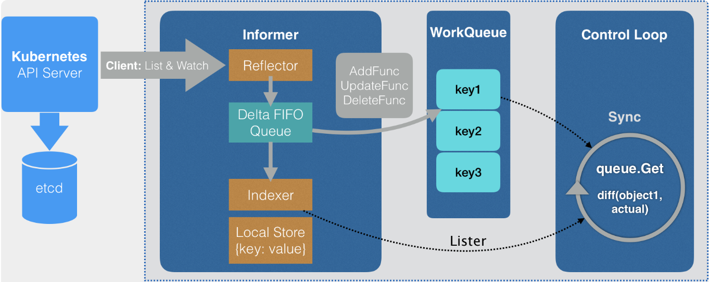

# Informer

注：阅读本笔记前请先阅读 [API](https://github.com/leopeng1995/kubernetes-notes/blob/master/api.md) 。

简单来说，Informer 就是用来提供一种 Kubernetes 资源的本地缓存机制，我理解有点像增量更新，通过 ADD、MODIFIED、DELETE 这几种资源变更事件实现对本地缓存的更新，Client 直接从本地缓存获取 Kubernetes 的资源。



首先从最简单的 Watch API 入手：

```bash
curl -k https://localhost:6443/api/v1/watch/pods?watch=yes -H "Authorization: Bearer ${token}"
```